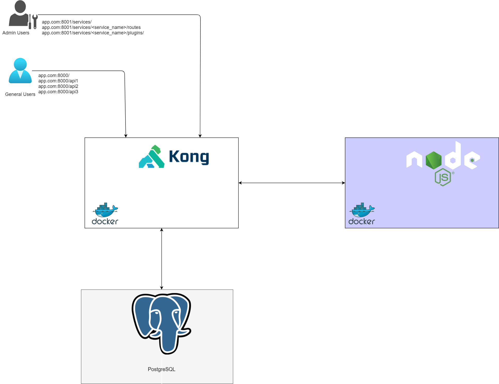

# Kong API Gateway on Amazon ECS with Service Discovery

This project contains the CloudFormation templates to deploy a Kong API Gateway container behind an Application Load Balancer to expose APIs

## Infrastructure Diagram

## Application Diagram
